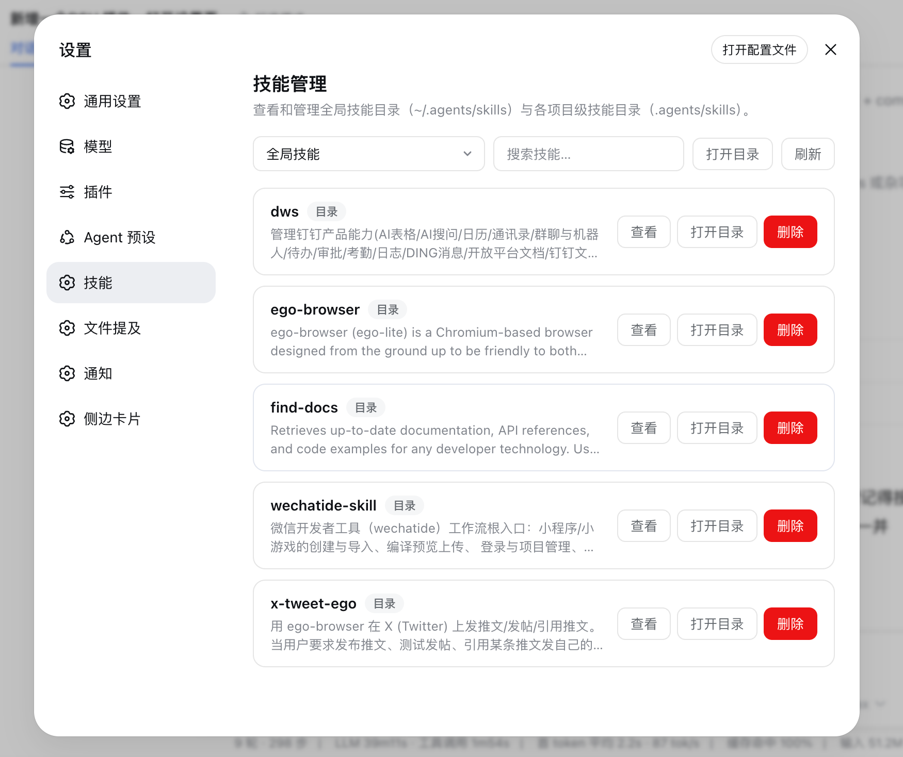

# dsh-skill-panel

[English](README.md)

一个 DeepSeek Harness 插件：在设置页新增「技能」面板，用于管理和查看本地技能目录：

- 全局：`~/.agents/skills`（遵循 `DSH_AGENTS_HOME`）
- 项目级：每个已注册工作区的 `<workspace>/.agents/skills`

面板列出每个技能，展示描述、正文与目录内容，支持当前作用域内搜索、删除技能、在系统文件管理器中打开目录。内置中英文文案。



## 结构

- `src/` — TypeScript 源码。`src/index.ts` 为 Host 插件（注册一个仅限回环的 Connection RPC 通道 `/skill-panel`）；`src/catalog.ts` 为纯文件系统目录逻辑（扫描/读取/删除/打开）；`src/client/` 为浏览器端（设置面板、文案、样式）；`src/contract.ts` 为共享通信契约。
- `lib/` — 提交的构建产物（`lib/index.js`、`lib/invariant.js`、`lib/client.js`）；profile 从这里解析 `main`、`./client` 与 `./invariant`。
- `tests/` — 基于 `node --test` 的目录逻辑测试。

## 构建

```
pnpm install
pnpm run build   # esbuild 打包 + tsc 类型声明
node --test tests/catalog.test.mjs
```

## 集成

以 bundle 方式安装进 profile，本地路径：

```
dsh plugin --profile web add file:/path/to/dsh-skill-panel
```

或直接从 GitHub 安装：

```
dsh plugin --profile web add git+https://github.com/hexbee/dsh-skill-panel.git
```

## 安全

- RPC 通道仅限回环访问（`authority: 'loopback'`），与所有设置面板一致。
- 项目级作用域只能通过 Host 已注册的工作区 id 寻址——浏览器端永远不会提交原始文件系统路径。
- 所有写操作都限制在 `~/.agents/skills` 或 `<workspace>/.agents/skills` 之内。
- 删除符号链接技能时只移除链接本身，链接目标不受影响。
